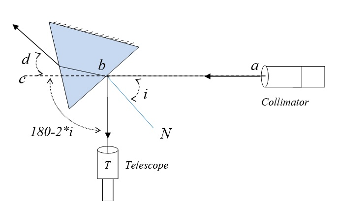
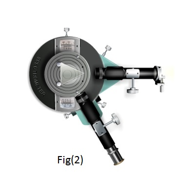
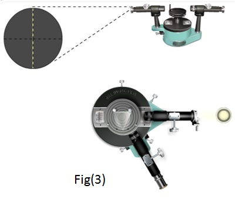
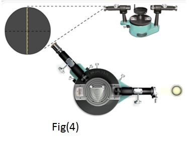
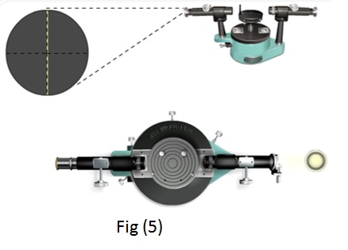
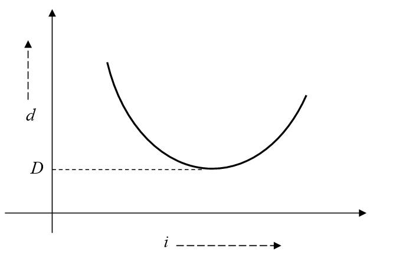
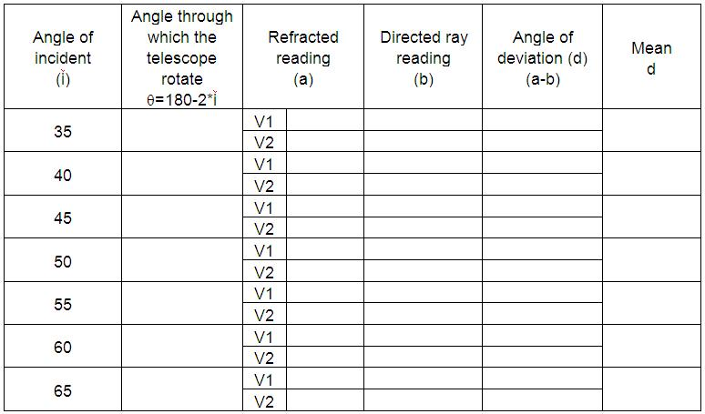

### Procedure

### Apparatus 
 
Spectrometer, prism, prism clamp, sodium vapour lamp, lens.

### Controls
#### Switches
- **Switch On/Off Light** : Used to switch on/off the light.
- **Place Prism/Remove Prism** : This switch used to place the prism on the prism table or remove prism from the prism table.
#### Slider
- **Slit focus** : This slider used to focus the slit while looking through telescope.
- **Slit width** : Using this slider, width of the slit can be adjusted.
- **Telescope**: Using this slider one can move the telescope from its position.
- **Vernier Table**: Vernier table can be rotate using this slider.
#### Fine Angle adjustment
- **Telescope**: This is used to fine adjust the telescope.
- **Vernier Table**: Using this slider , we can rotate fine angle.
#### Measurements
- The zoomed view of Vernier I and II can be used to note the readings.

 ### Preliminary adjustments:
 #### Performing simulator
- Focus Telescope on distant object.
- When focus is correct, start button is activated. Then click Start button.
- Switch on the light by clicking Switch On Light button.
- Focus the slit using Slit focus slider.
- Adjust the slit width using Slit width slider.
- Coincide the slit with cross wire in the telescope.
#### Performing Real Lab:

1. Turn the telescope towards the white wall or screen and looking through eye-piece, adjust its position till the cross wires are clearly seen.
2. Turn the telescope towards window, focus the telescope to a long distant object.
3. Place the telescope parallel to collimator.
4. Place the collimator directed towards sodium vapor lamp. Switch on the lamp.
5. Focus collimator slit using collimator focusing adjustment.
6. Adjust the collimator slit width.
7. Place prism table, note that the surface of the table is just below the level of telescope and collimator.
8. Place spirit level on prism table. Adjust the base leveling screw till the bubble come at the centre of spirit level.
9. Clamp the prism holder.
10. Clamp the prism in which the sharp edge is facing towards the collimator, and base of the prism is at the clamp.

### Least Count of Spectrometer

One main scale division (N)  =................minute

Number of divisions on vernier (v) = ................

L.C = $\frac{N}{v}$ = ................. minute

#### Procedure to find the angle of the prism

Refer to "Angle of prism" experiment.

### To draw i-d curve and obtain angle of minimum deviation

Consider ab is the incident ray of light on one face of the prism. i is the angle of incident and d is the angle of deviation.

Basic idea to set the incident angle is the ‘angle of incident and angle of reflection is same’. Therefore reflected ray from the surface of the prism is at an angle 180-2*i from c. 

Figure 1:Schematic representation of setting incident angle  

### To find angle of deviation (d) corresponds to incident angle i 

#### Performing simulator

Step 1: View the direct ray without the prism. Set the vernier and main scale in 0-0 in 0-180 position.

  

 

Step 2: For incident angle i ( say 30), rotate the Telescope to 180-2*i degrees in the anti-clock wise direction. (make sure the 0 line on the one of the vernier scale coincide with 120 in the main scale), see fig (2)

Step 3: Rotate the prism table in the clockwise direction so as to get the reflected image of slit from one face of the prism. And make it coincide with cross wire of the telescope, without rotating the telescope. Note the reading as θ. See Fig(3)

  

 

Step 4: Rotate the telescope in clock wise direction, without disturbing the vernier table, to find the emergent ray from other face of the prism. See fig(4)

  

 

Step 5: Make the slit coincide with the cross wire of telescope.

Step 6: Note down corresponding vernier 1 and vernier II reading. This reading is called refracted reading.

Step 7: to find the direct ray reading- remove the prism by clicking “remove prism” button.

  

 

Step 8: place the telescope in line with the collimator. (do not change vernier table position). See fig(5)

Step 9: Note down vernier I and vernier II readings. This reading is called directed ray reading.

Step 10: place the prism and bring vernier and main scale in 0-0 in 0-180 position.

Step 11: Repeat the step from 1 to 10, for different incident angle, and tabulate the readings and find angle of deviation (d).

Step 12: Plot the graph between i and d, where i is in x-axis and d is in y-axis. And note down the minimum value of d ( which is the angle of minimum deviation - D )

Figure 6: i-d curve 

Step 13: Using the equation 3, find out the refractive index of the prism.

### Performing Real lab

- Remove the prism and adjust the telescope direct to the collimator.
- Rotate the vernier table so as to get vernier 1 and 2 as 0-0 and 0-180.
- Place prism on prism table,
- For an incident angle i, rotate telescope to 180-2*i degrees in clock wise(or anticlock wise).
- Rotate vernier table anticlock wise( or clock wise) to get the reflected image of slit.
- Make the slit coincide with telescope cross wire.
- Rotate telescope in anticlock wise(or clock wise) direction, so as to get the emerged ray from the prism. Make it coincide with the cross wire and note the reading.
- Repeat the steps from 1 for different angle of incident.

 

Plot the graph between i and d, where i is in x-axis and d is in y-axis. From the graph, found the angle of minimum deviation.

##  Result:

- Angle of minimum deviation of the prism	=……………………………….Degrees  
- Refractive index of the prism	=...............................
